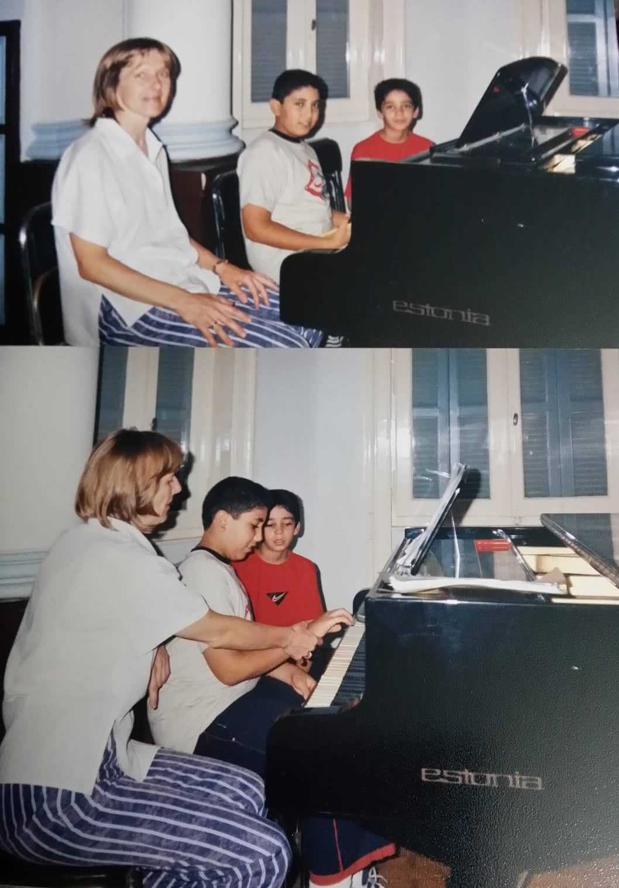

I started learning piano when I was a kid and then stopped a very long time ago. Having a lot of free time during COVID encouraged me to start playing again. I participated in the Mila Talent Show (yes, we have a talent show at Mila!) in 2021 where I  played <a href="https://drive.google.com/file/d/1qAO4XGsoHRJ6J7iyfh8owQkvXP2dk2p1/view?usp=sharing">My Heart Will Go On</a> by Celine Dion; and in 2022 where I played <a href="https://drive.google.com/file/d/1Kqf-kE5VoTM-59JaC0gZvcaF9gjIzFaJ/view?usp=sharing">Alla Turca</a> by Mozart (the video was taken by my beautiful friend Motahareh Sohrabi). 

  
More recently, I randomly bumped into someone in the metro carrying a cello, which made me curious to ask her where to learn. I learned that she had just finished her Ph.D. in music and now teaches cello, and she eventually became my cello teacher (her name is Jessica Korotkin, highly recommended). 

I play kickboxing, although I am still not very good at it, and I get punched in the face in almost every fight! I also love reading! Spending time reading is as exciting as spending time with one of my close friends!

